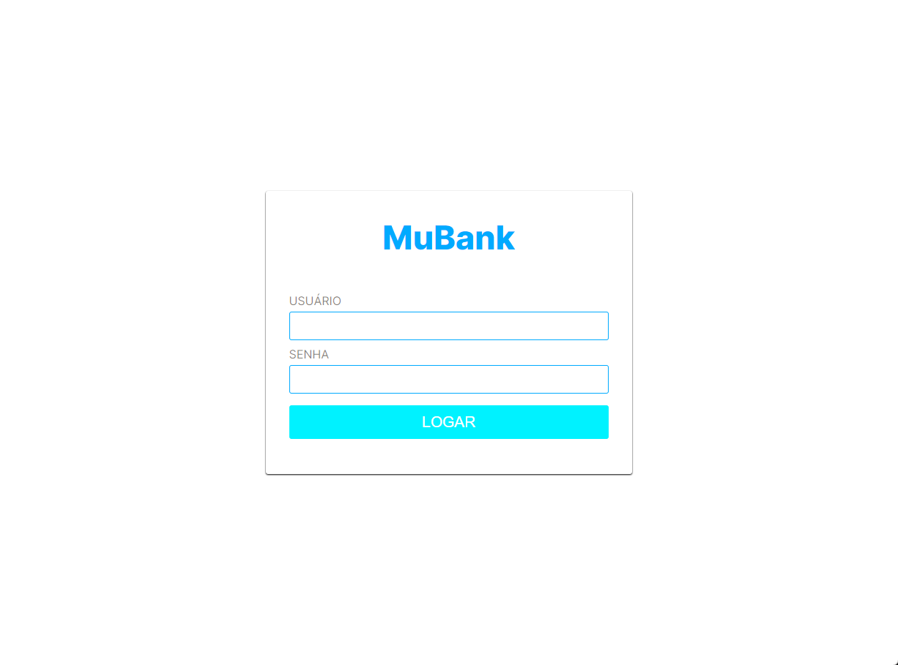
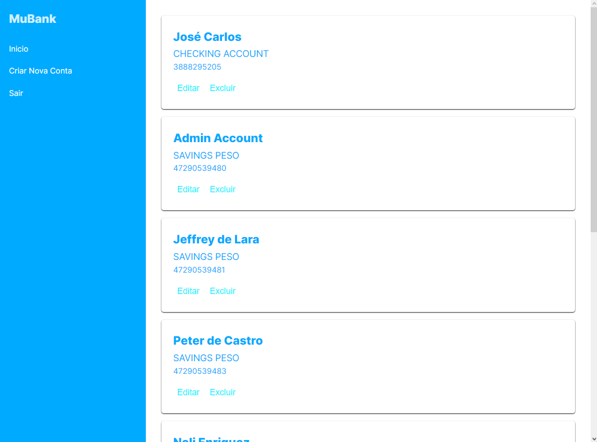
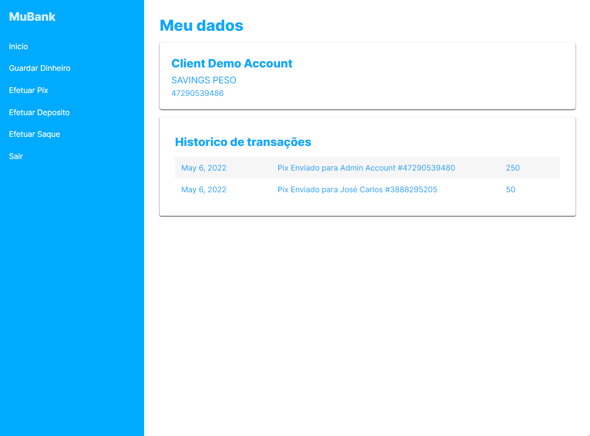

# testeTGT
[](https://github.com/vitusan/testeTGT/blob/main/LICENSE) 

# Sobre o projeto

O MuBank é uma aplicação front-end que foir construída para a entrevista de emprego na empresa **TGT Digital**, site [TGTDigital](https://www.tgtdigital.io/#/landing/tgt "Site da TGT Digital").

A aplicação consiste em uma página web simulando um sistema de gerenciamento de clientes no atendimento de Bancos.

## Layout web
-- Tela Login --


-- Tela administrador --


-- Tela Cliente --


# Tecnologias utilizadas
## Front end
- HTML5 / CSS3 / JS / JavaScript

# Como executar o projeto

## Front end web
Pré-requisitos: npm / yarn

```bash
# clonar repositório
git clone https://github.com/Lucasfaculdade/teste-open-banking.git

# entrar na pasta do projeto front end web
cd APP

# instalar dependências
node i

# executar o projeto
node index.js
```

# Autor

Lucas do Couto Menzes (https://www.linkedin.com/in/lucas-do-couto-55a31a186/)
